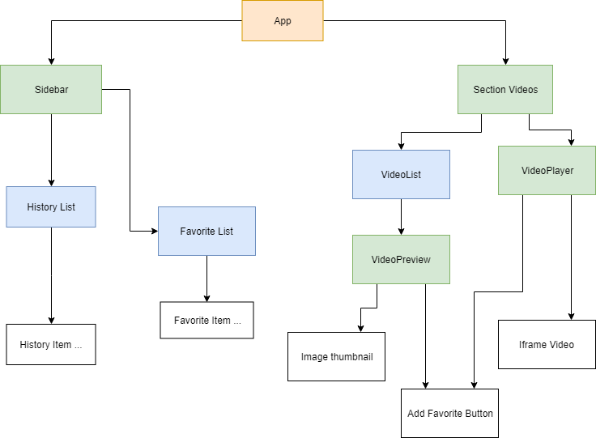

<!-- https://stackoverflow.com/questions/34226076/why-is-my-onclick-being-called-on-render-react-js -->
<!-- https://medium.com/@machnicki/handle-events-in-react-with-arrow-functions-ede88184bbb -->
<!-- https://reactjs.org/docs/faq-functions.html -->
<!-- http://www.reactjunkie.com/demistifying-es6-class-method-and-property-initializer-arrow-function/ -->
<!-- https://medium.freecodecamp.org/why-arrow-functions-and-bind-in-reacts-render-are-problematic-f1c08b060e36 -->
<!-- http://johnnyji.me/react/2016/06/27/why-arrow-functions-murder-react-performance.html -->

## Diagram Components & Containers

